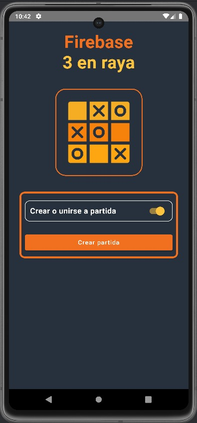
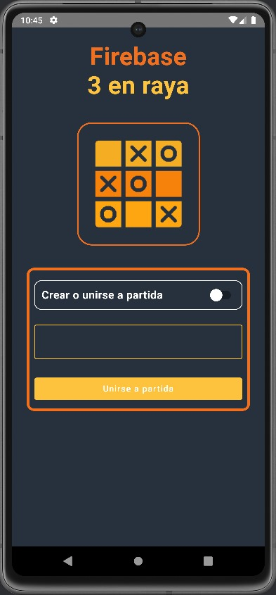
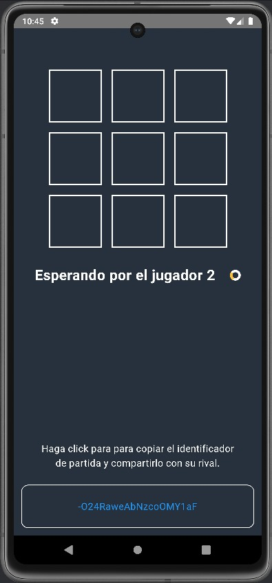
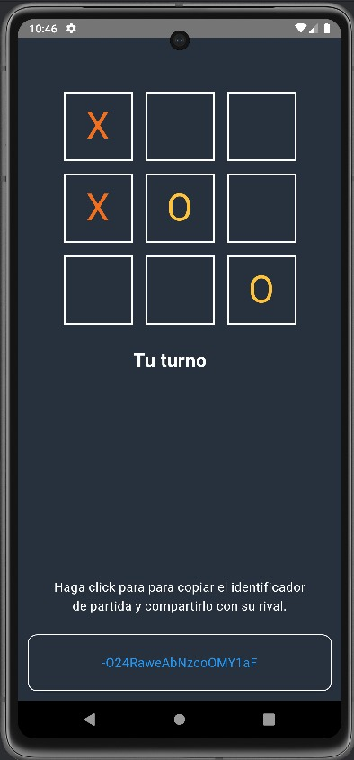
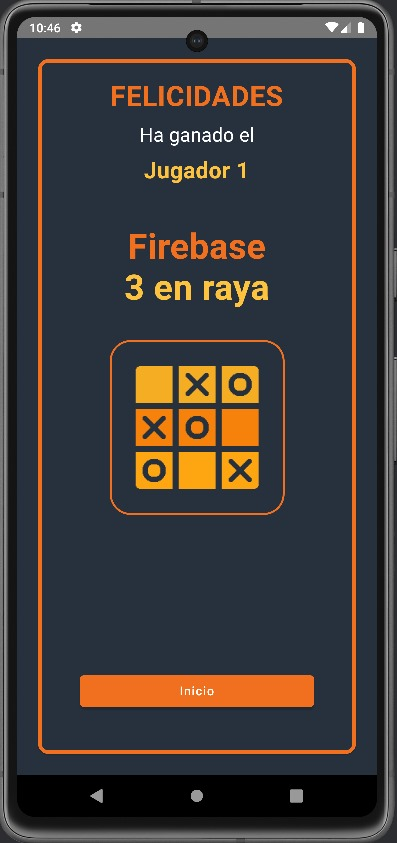

# TicTacToe / Android Compose

 
 

  

 
 

## Descripción
TicTacToe es un tres en raya para dos jugadores creado en Android Compose y Firebase.

 
 

### Pantallas
- **Inicio**: En la pantalla de inicio podremos crear una partida o unirnos a una existente.

 
 

  

 
 

- **Unirse a partida**: Para unirnos a una partida, el propietario de la misma debe compartirnos el identificador de partida

 
 

  

 
 

- **Pantalla de juego**: En la pantalla de juego podremos ver el tablero y el identificador de partida

 
 

  

 
 

- **Juego**: El juego se realizará por turnos.

 
 

  

 
 

- **Pantalla fin**: Cuando un jugador gane, nos mostrara la pantalla de fin, indicando el ganador, y pudiendo comenzar de nuevo.

 
 

  

 
 

## Instalación
Para instalar el proyecto, sigue estos pasos:
